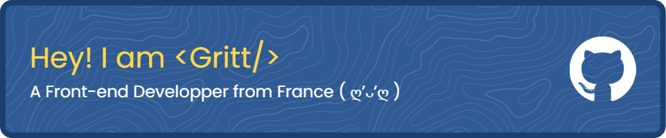

# Welcome to my Github profile



## 👓 About me

I'm Alexis, a 22 year old developer from France. I'm currently studying Web development at [ESGI](https://www.esgi.fr/), a french school of computer science in Paris. I do a lot of things and mainly interested in web development, game development and art/visuals. I'm also a big fan of anime and manga. 📚🎮🎨💡🛌

- 📫 You can reach me at ```alexistan dot webdev at gmail dot com``` 🤖
- 🌐 ~~You can also check out my [website](https://justgritt.github.io/)~~ (not available yet 😅)
- 🎮 I'm also on [Discord](https://discordapp.com/users/186404820935114752) if you want to talk

```csharp
> I create stuff with my good old laptop
-------------------------
💻 OS: MacOS 13.1 22C65 arm64
🧼 DE: Aqua
📂 WM: Quartz Compositor
🔮 Terminal: Alacritty
📝 Font: Caskaydia Cove
✨ CPU: Apple M1 Pro
```

## 🌈 What I have learned so far

> Languages and tools I have learned and used in my projects

                                               

## 📚 I am learning or want to learn

> Things I want to experiment with in the future
>
            

## 🎈 Other things

> 🎧 I'm currently listening to
>
[](https://open.spotify.com/user/nsakumaax)

<details>
  <summary>📈 GitHub Stats</summary>
  
  
  
</details>

<details>
  <summary>🏆 GitHub Trophies</summary>
  
</details>

<details>
  <summary>✨ Recent GitHub Activity</summary>

  <!--START_SECTION:activity-->
1. 🎉 Merged PR [#14](https://github.com/JustGritt/Payment-Platform/pull/14) in [JustGritt/Payment-Platform](https://github.com/JustGritt/Payment-Platform)
2. 💪 Opened PR [#14](https://github.com/JustGritt/Payment-Platform/pull/14) in [JustGritt/Payment-Platform](https://github.com/JustGritt/Payment-Platform)
3. 💪 Opened PR [#12](https://github.com/JustGritt/Payment-Platform/pull/12) in [JustGritt/Payment-Platform](https://github.com/JustGritt/Payment-Platform)
4. 💪 Opened PR [#9](https://github.com/JustGritt/Payment-Platform/pull/9) in [JustGritt/Payment-Platform](https://github.com/JustGritt/Payment-Platform)
5. 🎉 Merged PR [#7](https://github.com/JustGritt/Payment-Platform/pull/7) in [JustGritt/Payment-Platform](https://github.com/JustGritt/Payment-Platform)
  <!--END_SECTION:activity-->
</details>